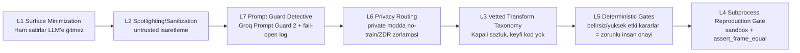

# Pareto Architecture

Bu belge, depodaki mevcut çalışan mimarinin tek sayfalık özetidir.

## 1) Tek Motor (Specification Atomu)

Çekirdeğin tek atom birimi `Specification` modelidir ([pareto/spec.py](pareto/spec.py)).

- outcome
- treatment
- controls
- unit_fe/time_fe
- cluster_by
- estimator
- sample_filter
- include_never_treated
- weight_col

OLS ve TWFE aynı atomun farklı noktalarıdır; staggered {CS, SA, BJS} eksen olarak tasarlanmıştır ancak henüz committed kapsamda değildir. Bu sayede runner, varyans ve raporlama akışları estimator-agnostik kalır.

## 2) Katmanlar (Sistem Bileşenleri)

- UI katmanı: [app/main.py](app/main.py) ve [app/pages](app/pages)
- Çekirdek sözleşme: [pareto/contracts.py](pareto/contracts.py), [pareto/spec.py](pareto/spec.py)
- Temizleme hattı: [pareto/cleaning](pareto/cleaning)
- Analiz hattı: [pareto/analysis](pareto/analysis)
- LLM katmanı: [pareto/llm](pareto/llm)
- Reprodüksiyon/paketleme: [pareto/repro](pareto/repro)

## 3) Deterministik vs Yargı Ayrımı

Sistemde iki çalışma şeridi vardır:

- Deterministik şerit: Profilleme, vetted transform uygulaması, estimator koşuları, varyans özeti, artefakt yazımı.
- Yargı şeridi: LLM destekli karar üretimi (temizleme önerisi, estimand/menü/narrative), insan onayı gereken noktalarda gatekeeper.

Deterministik şerit metrik üretir; yargı şeridi yorum/öneri üretir. Metrik hesabı yargı katmanına devredilmez.

## 4) 7 Katman Savunma Şeması

Not: Bu akış, etkileşim sırasındaki çalışma hattını gösterir; L1-L7 numaraları kronoloji değil savunma katmanı kimliğidir.

### L1

- Uygulama: [pareto/profiling.py](pareto/profiling.py)
- İlke: LLM'e satır düzeyi veri değil, yalnız özet profil gönderilir.

### L2

- Uygulama: [pareto/llm/guardrails.py](pareto/llm/guardrails.py)
- İlke: Güvenilmez metin alanları `〈untrusted〉...〈/untrusted〉` ile işaretlenir.

### L3

- Uygulama: [pareto/cleaning/transforms.py](pareto/cleaning/transforms.py), [pareto/cleaning/agent.py](pareto/cleaning/agent.py), [pareto/cleaning/ledger.py](pareto/cleaning/ledger.py)
- İlke: LLM yalnız kapalı sözlükten transform adı + tipli parametre seçer.

### L4

- Uygulama: [pareto/cleaning/codegen.py](pareto/cleaning/codegen.py)
- İlke: Diske yazılan temizleme scripti subprocess sandbox'ta tekrar çalıştırılır; sonuç in-process çıktı ile tolerans içinde eşleşmezse süreç durur.

### L5

- Uygulama: [pareto/cleaning/agent.py](pareto/cleaning/agent.py), [app/pages/1_cleaning.py](app/pages/1_cleaning.py)
- İlke: Yüksek-etki kararlar (ör. `drop_duplicates`) otomatik geçmez; profilde olmayan kolon referansı fail-loud durdurulur; yüksek-eksik/L7-suspicious kararlar zorunlu onay kapısına düşer.

### L6

- Uygulama: [pareto/llm/providers.py](pareto/llm/providers.py), [pareto/llm/router.py](pareto/llm/router.py), [tests/test_privacy_routing.py](tests/test_privacy_routing.py)
- İlke: private modda no-train/ZDR şartı zorlanır; free-train fallback sessizce geçmez.

### L7

- Uygulama: [pareto/llm/guardrails.py](pareto/llm/guardrails.py)
- İlke: Llama Prompt Guard 2 (Groq) ile detective tarama; hata durumunda fail-open (akış kesilmez), yalnız log + ledger izi bırakır.

## 5) Operasyonel Özeti

- Varsayılan akış: canned-default + BYOK öncelikli canlı çağrı.
- Test yaklaşımı: LLM adımlarında `TestModel` ile API'siz deterministik doğrulama, privacy/guardrail kuralları için ayrı sözleşme testleri.
- Reprodüksiyon: karar defteri + cleaning script + runner artefaktları tek paket olarak dışa alınabilir.

## 6) Mimari Kararlar

- ADR indeksi: [docs/adr/README.md](docs/adr/README.md)
- Tek motor: [docs/adr/0001-tek-motor-specification.md](docs/adr/0001-tek-motor-specification.md)
- Vetted transform/codegen: [docs/adr/0002-vetted-transform-codegen.md](docs/adr/0002-vetted-transform-codegen.md)
- Subprocess runner: [docs/adr/0003-subprocess-runner.md](docs/adr/0003-subprocess-runner.md)
- LLM router/providers/cache: [docs/adr/0004-pydanticai-model-router.md](docs/adr/0004-pydanticai-model-router.md)
- Estimator library: [docs/adr/0005-tek-lib-pyfixest.md](docs/adr/0005-tek-lib-pyfixest.md)
