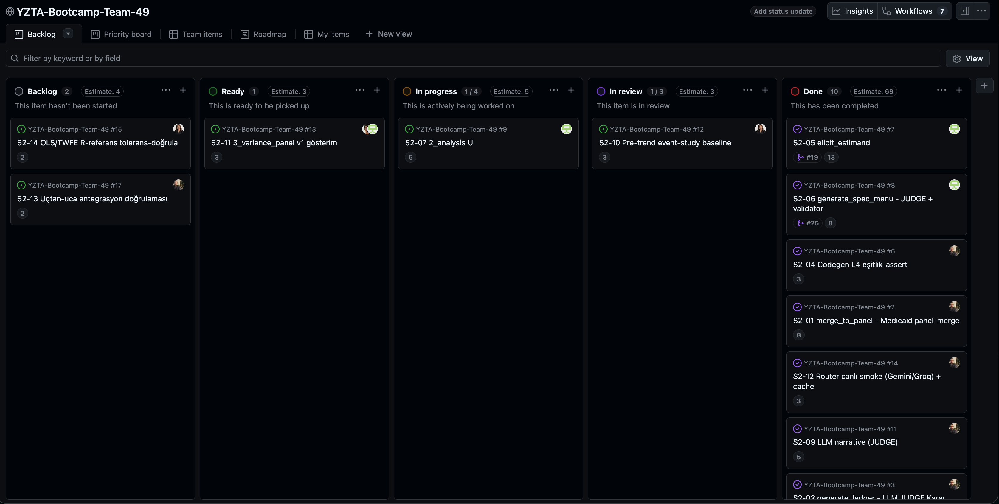
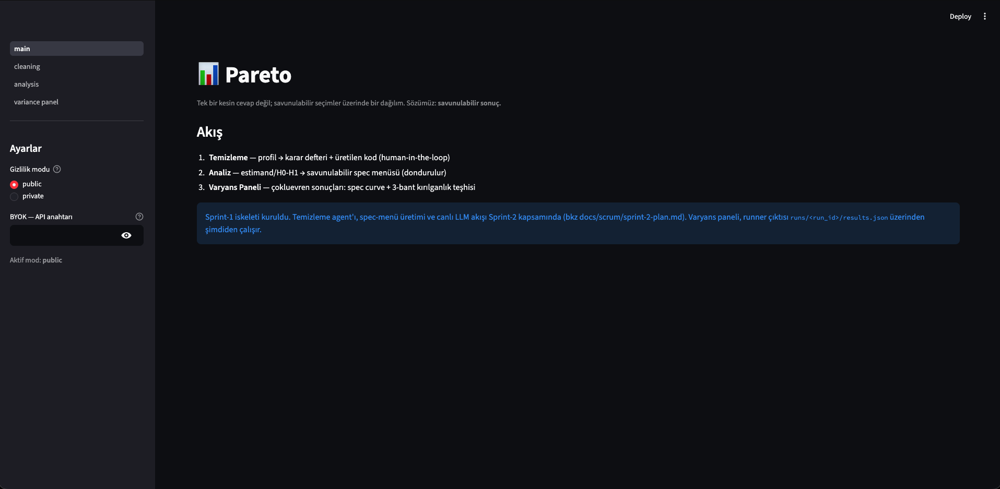
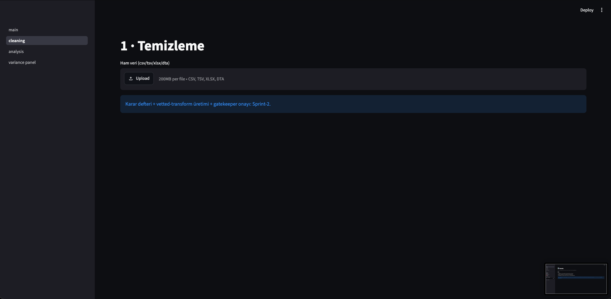
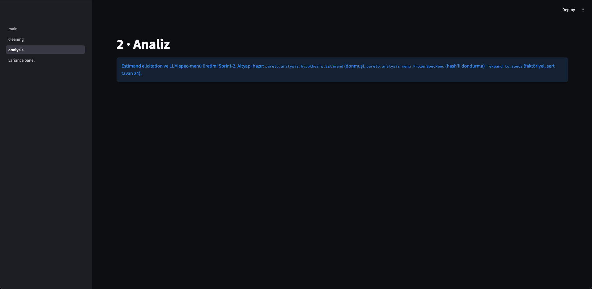
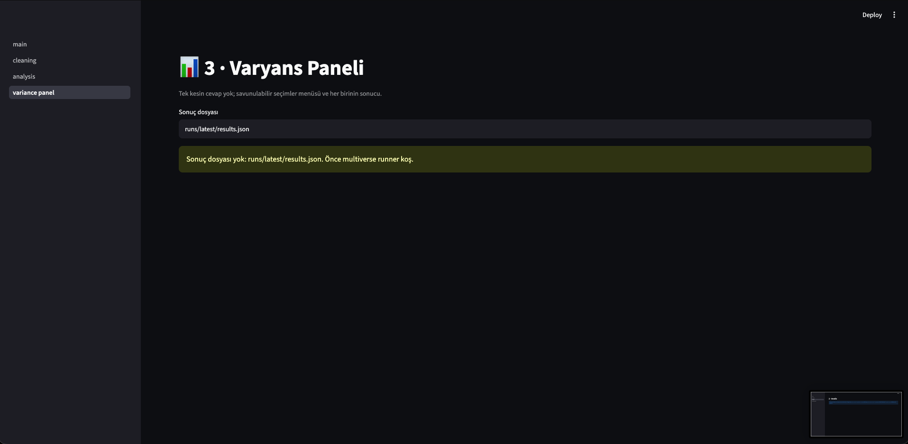
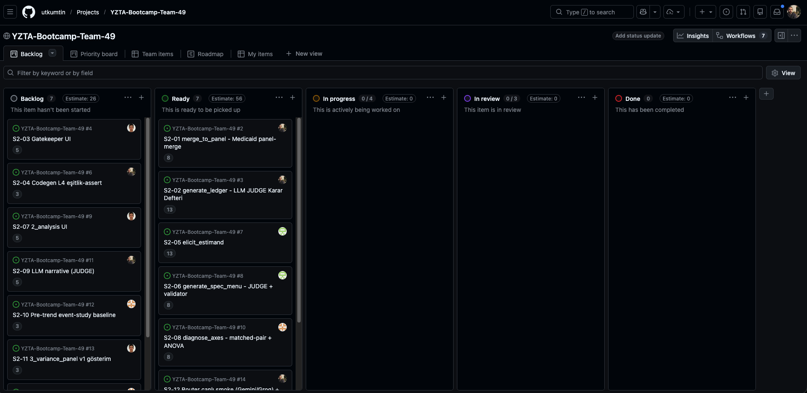
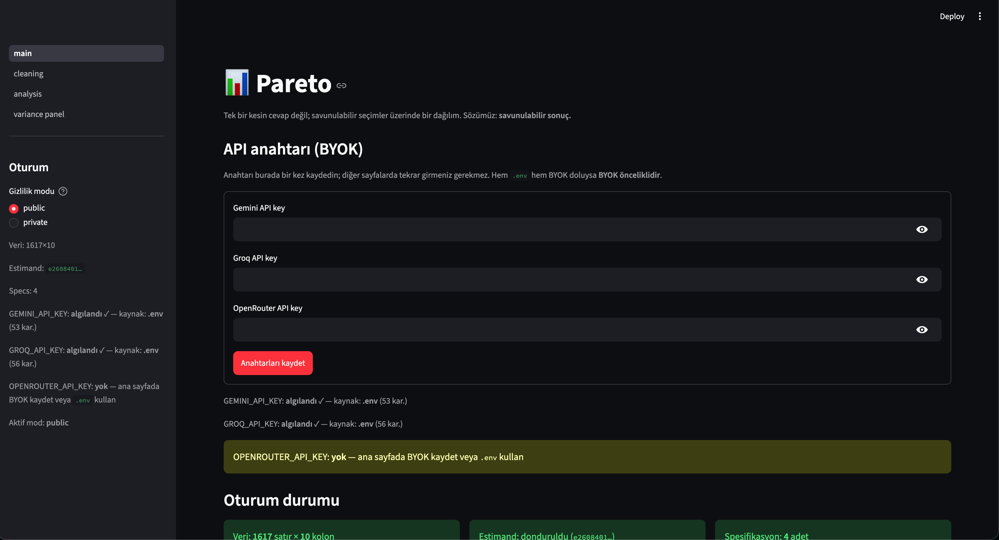
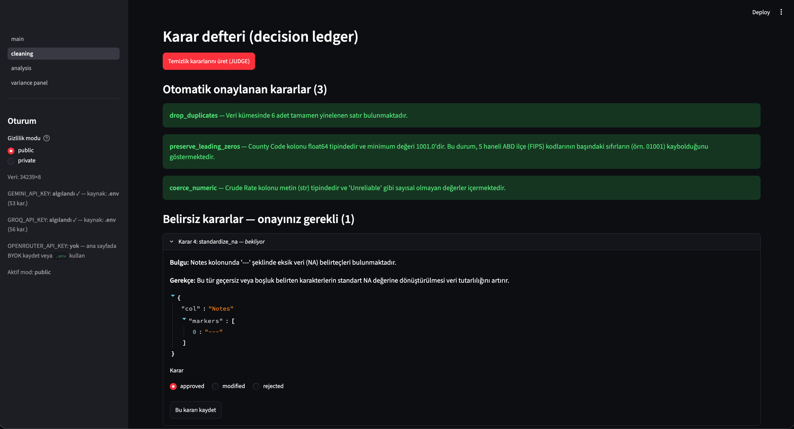
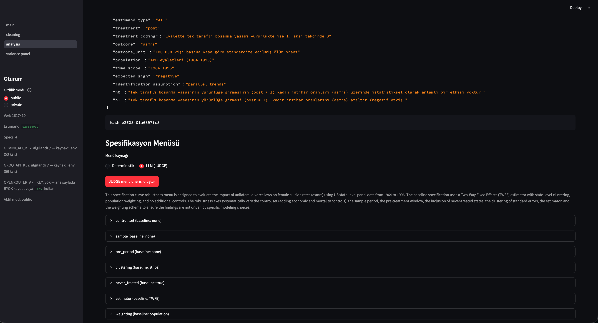
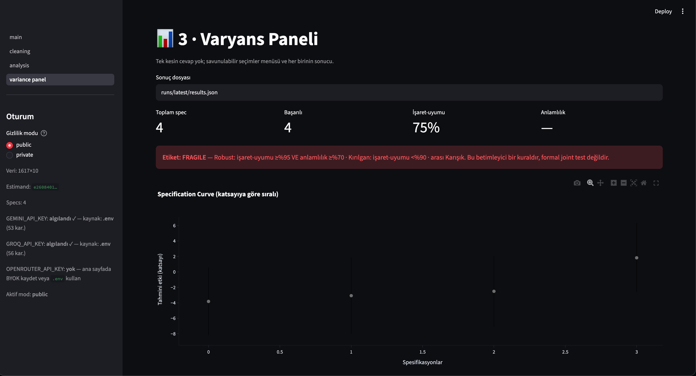

# Team 49 · Pareto

> **Pareto**: a defensible-inference engine for empirical social-science researchers.
> *Not one confident answer, but a distribution over defensible choices, and where & why it is fragile.*

---

## Team Members

| Member | Role | Social |
|--------|------|--------|
| [Utku Metin](https://github.com/utkumtin) | Product Owner | [LinkedIn](https://www.linkedin.com/in/utkumtn/) |
| [Ozan Çelik](https://github.com/Ozan7146) | Scrum Master | [LinkedIn](https://www.linkedin.com/in/ozan-%C3%A7elik-7b8062221/) |
| [Betül Bostan](https://github.com/betul-bostan) | Developer | [LinkedIn](https://www.linkedin.com/in/bet%C3%BCl-bostan-2105942b2/) |
| [Utku Uzunhüseyin](https://github.com/utkuzuunhuseyin) | Developer | [LinkedIn](https://www.linkedin.com/in/utku-uzunh%C3%BCseyin/) |

---

<details open>
<summary><h2>Product Description</h2></summary>

**Pareto** is a defensible-inference engine for empirical social-science researchers. Instead
of a single confident number, it returns a **distribution over defensible choices**, and tells
you *where* and *why* the result is fragile.

Two moves, one promise (**a defensible result**):

1. **Black-box-free, human-in-the-loop cleaning.** Every fix is a logged decision (a *decision
   ledger*) plus generated, reproducible code: your audit trail and methods section, for free.
2. **Context-aware multiverse analysis.** Pareto runs controls × sample × estimator
   specifications in parallel and surfaces the spread in a **variance panel** that says not just
   *"fragile"* but *why*: "8 of 10 runs are positive; the 2 that flip do so when the estimator
   goes TWFE → Callaway-Sant'Anna."

<details>
<summary><h4>Türkçe açıklama</h4></summary>

**Pareto**, ampirik sosyal-bilim araştırmacıları için bir *savunulabilir çıkarım* motorudur.
Tek bir kesin sayı yerine, **savunulabilir seçimler üzerinde bir dağılım** verir; sonucun
*nerede* ve *neden* kırılgan olduğunu söyler.

İki hamle, tek söz (**savunulabilir sonuç**):

1. **Kara-kutu olmayan, human-in-the-loop temizleme.** Her düzeltme loglanmış bir karardır
   (*karar defteri*) + üretilen tekrarlanabilir kod: denetim iziniz ve metot bölümünüz hazır gelir.
2. **Bağlam-farkında çokluevren analizi.** Kontrol × örneklem × estimator spesifikasyonları
   paralel koşulur; dağılım **varyans panelinde** yalnız *"kırılgan"* değil *nedenini* söyleyerek
   gösterilir: "10 koşunun 8'i pozitif; dönen 2'si estimator TWFE → Callaway-Sant'Anna olunca döner."

</details>
</details>

---

<details>
<summary><h2>Product Features</h2></summary>

- **Ingest & profiling**: CSV/Excel (committed), `.dta` (cheap). Deterministic column profiling
  sends only a *summary payload* to the LLM; raw rows never leave the machine.
- **Human-in-the-loop cleaning agent**: auto-applies high-confidence fixes, asks only genuine
  ambiguities, logs a **decision ledger**, and emits reproducible code from a **closed, vetted
  transform library** (no arbitrary code generation). Panel-merges multiple sources into a
  unit×time panel.
- **Estimand-first hypothesis**: Socratic + TAC elicitation produces a **frozen, hashed
  Estimand** (H0/H1, treatment, identification assumption) *before* any result is seen; kills anchoring.
- **Defensible spec-menu**: a judge model proposes defensible levels per axis + a baseline; the
  researcher "draws the lit path" with 4 verbs (approve / edit / remove / add). The menu is
  **frozen + hashed** for reproducibility.
- **Multiverse runner**: a deterministic subprocess engine runs the factorial cross-product of
  active axes (hard cap **24 specs**) via `pyfixest`, with live disk progress.
- **Variance panel**: specification curve + summary (% positive, sign changes) + deterministic
  matched-pair / ANOVA **axis attribution** + a **3-band robust/fragile label** + pre-trend
  event-study + an LLM narrative that *explains* (never measures).
- **Cross-cutting**: a model router (cheap model for mechanical work, a pinned strong model for
  judgment), persistent project memory, a one-click reproduction bundle, and **privacy-by-design**
  (public/demo vs private no-train modes).

<details>
<summary><h4>Türkçe açıklama</h4></summary>

- **Ingest & profilleme**: CSV/Excel (committed), `.dta` (ucuz). Deterministik kolon profillemesi
  LLM'e yalnız *özet payload* gönderir; ham satırlar makineden çıkmaz.
- **Human-in-the-loop temizleme ajanı**: yüksek-güvenli düzeltmeleri otomatik uygular, yalnız
  gerçek belirsizlikleri sorar, bir **karar defteri** tutar ve **kapalı/vetted transform
  kütüphanesinden** tekrarlanabilir kod üretir (keyfi kod üretimi YOK). Çok kaynağı unit×time
  panele birleştirir.
- **Estimand-first hipotez**: Socratic + TAC ile, herhangi bir sonuç görülmeden **donmuş, hash'li
  Estimand** (H0/H1, tedavi, tanımlama varsayımı) üretilir; anchoring'i öldürür.
- **Savunulabilir spec-menü**: yargı modeli her eksende savunulabilir seviyeler + baseline önerir;
  araştırmacı 4 fiille (onayla / düzenle / çıkar / ekle) "aydınlık yolu çizer". Menü reprodüksiyon
  için **dondurulur + hash'lenir**.
- **Multiverse runner**: deterministik subprocess motoru aktif eksenlerin faktöriyel çarpımını
  (sert tavan **24 spec**) `pyfixest` ile koşar, diske canlı ilerleme yazar.
- **Varyans paneli**: spec-curve + özet (% pozitif, işaret değişimi) + deterministik matched-pair /
  ANOVA **eksen atfı** + **3-bant robust/fragile etiketi** + pre-trend event-study + *açıklayan*
  (asla ölçmeyen) bir LLM narrative.
- **Kesişen**: model router (mekanik iş ucuz modele, yargı pinli güçlü modele), kalıcı proje
  hafızası, tek-tık reprodüksiyon paketi ve **tasarımdan-gizlilik** (public/demo vs private no-train).

</details>
</details>

---

<details>
<summary><h2>Target Audience</h2></summary>

- **Beachhead:** PhD students and early-career empirical social-science researchers at the
  **econometrics / causal-inference / difference-in-differences** intersection: those who feel the
  data-drudgery pain and retraction fear most, and are least locked into legacy workflows.
- **Broader field:** economics, political science, public-health policy, sociology, empirical finance.

<details>
<summary><h4>Türkçe açıklama</h4></summary>

- **Beachhead:** **ekonometri / nedensel çıkarım / fark-farkın-farkı (DiD)** kesişimindeki doktora
  ve erken-kariyer ampirik sosyal-bilim araştırmacıları: veri angaryasını ve geri-çekilme (retraction)
  korkusunu en çok yaşayan, eski iş akışlarına en az bağlı grup.
- **Geniş alan:** ekonomi, siyaset bilimi, halk sağlığı politikası, sosyoloji, ampirik finans.

</details>
</details>

---

## Product Backlog

We run the project from a **GitHub Projects Kanban** board (Backlog · Ready · In Progress · In
Review · Done). Each card is a user story with story points, an owner, and a task/acceptance checklist.

- **Board:** [GitHub Projects Kanban](https://github.com/users/utkumtin/projects/3)
- **Screenshot:** 

---

# Sprint 1

<details>
<summary><h2>Product Status</h2></summary>

Sprint 1 was design/foundation-heavy, so by design there is no empirical run yet. The product
status is a running, end-to-end **Streamlit walking skeleton** on top of the typed core: the
landing page (mode + BYOK) and the three flow pages. LLM-driven steps land in Sprint 2, and each
page says so explicitly instead of faking output (fail-loud):

| Landing: mode + BYOK + flow overview | 1 · Cleaning: upload + profiling entry |
|---|---|
|  |  |

| 2 · Analysis: estimand-first seam (Sprint 2) | 3 · Variance panel: reads runner output |
|---|---|
|  |  |

<details>
<summary><h4>Türkçe açıklama</h4></summary>

Sprint 1 tasarım/temel ağırlıklıydı; tasarım gereği henüz ampirik koşu yok. Ürün durumu, tipli
çekirdeğin üzerinde uçtan uca çalışan **Streamlit yürüyen iskeleti**: açılış sayfası (mod + BYOK)
ve üç akış sayfası. LLM'li adımlar Sprint 2'de gelir; her sayfa bunu sahte çıktı göstermek yerine
açıkça söyler (fail-loud). Görseller: açılış · 1·Temizleme (yükleme + profilleme girişi) ·
2·Analiz (estimand-first dikişi) · 3·Varyans Paneli (runner çıktısını okur).

</details>
</details>

<details>
<summary><h2>Project Management / Board</h2></summary>

GitHub Projects Kanban with per-column WIP limits (In Progress 4 · In Review 3) and a
numeric `Estimate` field per card (Fibonacci story points):



</details>

- **Sprint Notes:**
  * Locked the idea & thesis **"a defensible result"**: the variance *is* the product.
  * Wrote the scope document (SCOPE): committed / fast-follow / upside; **hero dataset = ACA
    Medicaid expansion**.
  * Accepted **5 architecture decisions (ADR 0001–0005):** single engine (`Specification` atom) ·
    closed/vetted codegen (the LLM never writes arbitrary code) · subprocess runner (not
    ProcessPool) · PydanticAI + model router · single estimator library (**pyfixest**).
  * Migrated the prototype into a typed committed core, resolving **the 4 critical review
    conflicts** (codegen RCE `exec` → vetted-transform render · ProcessPool → subprocess · raw
    SDK + regex-JSON → PydanticAI · missing contracts/axes; hard cap 500 → 24).
  * Landed the skeleton + typed core + CI (uv · ruff · mypy · pre-commit + gitleaks · GitHub Actions).
- **Expected point completion within Sprint:** `34` Points
- **Point Completion Logic:** We estimate stories in **Fibonacci story points** (1·2·3·5·8·13),
  sizing *relative effort / complexity / uncertainty* rather than hours; stories above 13 are split.
  We do **not** pre-fix a grand total: each sprint's commitment is set by team availability and
  velocity is tracked sprint over sprint. **Sprint 1** (design / foundation) committed and completed
  **~34 points**; **Sprint 2** commits **84** (heaviest: committed core, end-to-end); **Sprint 3**
  (polish + ship) is estimated at its start.
- **Daily Scrum:** No daily stand-ups this sprint; the team synced in **3 Slack Huddle calls**
  (20 Jun · 21 Jun · 4 Jul), with async coordination in a shared WhatsApp group. A fixed daily
  cadence + channel (with archived notes) is a Sprint 2 action item (see Retrospective).
  <details>
  <summary>Huddle screenshots</summary>

  
  
  

  </details>
- **Product Backlog URL:** [GitHub Projects Kanban](https://github.com/users/utkumtin/projects/3)
- **Sprint Review:**
  * The first sprint was spent on ideation, scoping, and locking the architecture; no empirical
    run yet, by design.
  * Product thesis and target audience were fixed; the committed / fast-follow / upside boundary
    was drawn and the ACA Medicaid hero chosen.
  * 5 ADRs were accepted and the prototype was migrated into a clean, typed core with green CI.
  * Decided that the empirical estimator-flip spike (`divorce` / `castle` + Medicaid core axis)
    moves to **Sprint 2** as an early go/no-go.
- **Sprint Review Participants:** Utku Metin, Ozan Çelik, Betül Bostan, Utku Uzunhüseyin
- **Sprint Retrospective:**
  * Estimate **story points at the start** of the sprint (the scheme was set up only at this
    sprint's end) → Sprint 2 begins with a fully-pointed board.
  * Fix the **daily-scrum cadence + channel** and archive screenshots regularly.
  * Pull the **empirical flip spike** earlier (go/no-go up front).
  * Adopt **availability-based planning** (U is unavailable in week 1 → cleaning backend pulled forward).
  * Write a **`TestModel` test for every new LLM step** from the start (intent over behaviour).
  * **Assign the Scrum Master** role explicitly (done: Ozan Çelik).

<details>
<summary><h4>Türkçe açıklama</h4></summary>

- **Sprint Notları:**
  * Fikir & tez kilitlendi, **"savunulabilir sonuç"**: varyansın kendisi üründür.
  * Kapsam dokümanı (SCOPE) yazıldı: committed / fast-follow / upside; **hero veri = ACA Medicaid genişlemesi**.
  * **5 mimari karar (ADR 0001–0005) kabul edildi:** tek motor (`Specification` atomu) · kapalı/vetted
    codegen (LLM keyfi kod yazmaz) · subprocess runner (ProcessPool değil) · PydanticAI + model
    router · tek estimator kütüphanesi (**pyfixest**).
  * Prototip tipli committed core'a migre edildi; review'in **4 kritik çatışması** giderildi (codegen
    RCE `exec` → vetted-transform render · ProcessPool → subprocess · ham SDK + regex-JSON →
    PydanticAI · eksik kontrat/eksen; sert tavan 500 → 24).
  * İskelet + tipli çekirdek + CI (uv · ruff · mypy · pre-commit + gitleaks · GitHub Actions) indirildi.
- **Sprint İçinde Tamamlanması Beklenen Puan:** `34` Puan
- **Puan Tamamlama Mantığı:** Story'ler **Fibonacci story point** (1·2·3·5·8·13) ile puanlanır;
  saat değil *göreli efor / karmaşıklık / belirsizlik* ölçülür; 13 üstü story bölünür. **Sabit bir
  proje-toplamı belirlenmez:** her sprint taahhüdü ekip müsaitliğine göre kurulur, velocity sprint
  sprint izlenir. **Sprint 1** (tasarım / temel) **~34 puan** taahhüt edip tamamladı; **Sprint 2**
  **84** taahhüt eder (en ağır: committed çekirdek, uçtan uca); **Sprint 3** (cila + ship) sprint
  başında tahmin edilir.
- **Daily Scrum:** Bu sprint günlük stand-up yapılmadı; **3 Slack Huddle görüşmesi** (20.06 ·
  21.06 · 04.07) ve WhatsApp grubunda asenkron koordinasyon ile senkronize olundu (ekran
  görüntüleri yukarıdaki İngilizce bölümde). Sabit günlük kadans + kanal (arşivlenen notlarla)
  Sprint 2 aksiyon maddesidir (bkz Retrospektif).
- **Sprint Gözden Geçirilmesi (Review):**
  * İlk sprint fikir, kapsam ve mimari kilidiyle geçti; tasarım gereği henüz ampirik koşu yok.
  * Ürün tezi ve hedef kitle sabitlendi; committed / fast-follow / upside sınırı çizildi, Medicaid hero seçildi.
  * 5 ADR kabul edildi, prototip temiz tipli çekirdeğe migre edildi, CI yeşil.
  * Ampirik estimator-flip spike'ının (`divorce` / `castle` + Medicaid çekirdek ekseni) erken go/no-go
    olarak **Sprint 2'ye** taşınmasına karar verildi.
- **Sprint Gözden Geçirme Katılımcıları:** Utku Metin, Ozan Çelik, Betül Bostan, Utku Uzunhüseyin
- **Sprint Retrospektifi:**
  * Story-point tahmini sprint **başında** yapılmalı (şema bu sprint sonunda kuruldu) → Sprint 2 baştan puanlı board ile başlar.
  * Daily-scrum kadansı + kanalı netleştir, screenshot'ları düzenli arşivle.
  * Ampirik **flip spike** öne alınmalı (go/no-go baştan).
  * **Müsaitlik-bazlı planlama** benimsendi (U Hafta-1 yok → temizleme backend'i öne çekildi).
  * Her yeni LLM adımı için baştan **`TestModel` testi** yazılmalı (davranış değil niyet).
  * **Scrum Master** rolü net atanmalı (atandı: Ozan Çelik).

</details>

---

# Sprint 2

<details>
<summary><h2>Product Status</h2></summary>

Sprint 2 turned the Sprint 1 walking skeleton into a working pipeline: the LLM-driven steps
that each page previously announced as "Sprint 2" are now live. The estimand-first hypothesis
flow (Socratic + TAC → frozen, hashed Estimand), the JUDGE spec-menu, the cleaning agent with
its decision ledger and human gate, deterministic axis diagnostics and the LLM variance
narrative all run end-to-end on the committed datasets, with the model router connected to
live providers (BYOK-first) and session state preserved across pages:

| Landing: mode + BYOK + session summary | 1 · Cleaning: profiling + agent + ledger |
|---|---|
|  |  |

| 2 · Analysis: frozen estimand + JUDGE spec menu | 3 · Variance panel: diagnostics + narrative |
|---|---|
|  |  |

<details>
<summary><h4>Türkçe açıklama</h4></summary>

Sprint 2, Sprint 1'in yürüyen iskeletini çalışan bir boru hattına çevirdi: her sayfanın
"Sprint 2'de gelecek" dediği LLM'li adımlar artık canlı. Estimand-first hipotez akışı
(Socratic + TAC → donmuş, hash'li Estimand), JUDGE spec-menü, karar defterli + insan-kapılı
temizleme ajanı, deterministik eksen diagnostikleri ve LLM varyans narrative'i committed
veri setleri üzerinde uçtan uca koşuyor; model router canlı sağlayıcılara bağlı (önce BYOK)
ve oturum durumu sayfalar arasında korunuyor. Görseller: açılış (oturum özeti) ·
1·Temizleme (profilleme + ajan + karar defteri) · 2·Analiz (donmuş estimand + JUDGE menü) ·
3·Varyans Paneli (diagnostik + narrative).

</details>
</details>

<details>
<summary><h2>Project Management / Board</h2></summary>

Board state at the end of Sprint 2 (WIP limits and Fibonacci `Estimate` field unchanged):


</details>

- **Sprint Notes:**
  * **Estimand-first flow landed** (PR #19): Socratic + TAC elicitation → frozen, hashed
    Estimand, with validator and API-free `TestModel` tests.
  * **JUDGE spec-menu** (PR #20 · #21 · #25): judge-proposed defensible levels + baseline per
    axis, menu validator, weighting axis; menu frozen + hashed.
  * **Datasets committed** (PR #22): `medicaid` (hero), `divorce`, `castle`, `card_krueger`
    with a fetch script and `SOURCES.md`.
  * **Cleaning agent core** (PR #26): high-confidence auto-fixes + decision ledger
    (S2-01 · S2-02), plus a **human gate for uncertain decisions** (PR #29).
  * **Deterministic axis attribution** (S2-08, PR #27): matched-pair + ANOVA diagnostics.
  * **Codegen assert hardening** for the vetted transform library (S2-04, PR #31).
  * **Empirical go/no-go spike** (S2-15, PR #30): estimator sign-flip reproduced on
    `divorce` / `castle` — the spike pulled forward per the Sprint 1 retrospective.
  * **LLM variance narrative** (PR #33): explains the spread, never measures it.
  * **Router live** (PR #34): connected to real providers with response caching; BYOK
    precedence fixed (a pasted key overrides server keys).
  * **Session-state persistence** across pages (data / estimand / spec summary on the landing page).
- **Expected point completion within Sprint:** `84` Points — `72` completed.
- **Point Completion Logic:** Same Fibonacci scheme as Sprint 1 (relative effort, no fixed
  grand total, velocity tracked sprint over sprint). Sprint 2 was the heaviest sprint
  (committed core, end-to-end) at **84 committed points**, of which **72 were completed**.
  The remaining **12 points** — S2-07 (2_analysis UI) · S2-11 (variance-panel v1 display) ·
  S2-13 (end-to-end integration validation) · S2-14 (OLS/TWFE R-reference tolerance check) —
  carry over into Sprint 3.
- **Daily Scrum:** No calls this sprint; all coordination ran **asynchronously in the team
  WhatsApp group** — the single, archived channel agreed in the Sprint 1 retrospective.
  Instead of screenshots, the full Sprint 2 chat log is exported and committed:
  [Sprint 2 WhatsApp log](docs/sprint-comms/sprint-2-chat.txt).
- **Product Backlog URL:** [GitHub Projects Kanban](https://github.com/users/utkumtin/projects/3)
- **Sprint Review:**
  * Ozan Çelik built the estimand-first flow and the JUDGE spec-menu, wired BYOK + session
    state into the UI, and added the human gate for uncertain cleaning decisions.
  * Betül Bostan implemented the matched-pair / ANOVA axis diagnostics and ran the
    estimator sign-flip spike on `divorce` / `castle` (the early go/no-go).
  * Utku Metin committed the datasets, the cleaning-agent core, codegen asserts, the LLM
    variance narrative, and connected the router to live providers.
  * Utku Uzunhüseyin could not be active this sprint (work / relocation); tasks were
    redistributed by availability, as planned in the Sprint 1 retrospective.
  * 72 of 84 points were completed; the 4 remaining issues (12 points) roll into Sprint 3.
  * PR review turnaround became the bottleneck near the sprint's end (a review deadlock on
    the last open PR) — addressed in the retrospective.
- **Sprint Review Participants:** Utku Metin, Ozan Çelik, Betül Bostan, Utku Uzunhüseyin
- **Sprint Retrospective:**
  * **Fix the PR review bottleneck:** reviews within ~24h or a fallback reviewer steps in;
    never end a sprint with an unreviewed PR blocking a dependent task.
  * **Carry-over first:** Sprint 3 starts by redistributing the 4 open Sprint 2 issues
    across owners before any new scope is added.
  * **Availability-based planning continues:** Sprint 3 capacity was collected in-channel
    (18–19 Jul) and issues are assigned to match each member's stated hours.
  * **Async cadence kept, calls added:** WhatsApp-as-archived-channel worked (this log is
    the proof), but Sprint 3 adds at least one mid-sprint sync call.
  * **Process fixed early and kept:** feature PRs target `dev`; `main` is updated weekly.

<details>
<summary><h4>Türkçe açıklama</h4></summary>

- **Sprint Notları:**
  * **Estimand-first akış indi** (PR #19): Socratic + TAC → donmuş, hash'li Estimand;
    validator + API'siz `TestModel` testleri.
  * **JUDGE spec-menü** (PR #20 · #21 · #25): eksen başına savunulabilir seviyeler + baseline,
    menü validator'ü, ağırlıklandırma ekseni; menü dondurulup hash'lenir.
  * **Veri setleri commit'lendi** (PR #22): `medicaid` (hero), `divorce`, `castle`,
    `card_krueger` + indirme script'i + `SOURCES.md`.
  * **Temizleme ajanı çekirdeği** (PR #26): yüksek-güvenli otomatik düzeltme + karar defteri
    (S2-01 · S2-02); **belirsiz kararlarda insan kapısı** (PR #29).
  * **Deterministik eksen atfı** (S2-08, PR #27): matched-pair + ANOVA diagnostikleri.
  * **Codegen assert sıkılaştırması** (S2-04, PR #31).
  * **Ampirik go/no-go spike** (S2-15, PR #30): `divorce` / `castle` üzerinde estimator işaret
    değişimi yeniden üretildi — Sprint 1 retrosunda öne çekilen spike.
  * **LLM varyans narrative'i** (PR #33): açıklar, asla ölçmez.
  * **Router canlı** (PR #34): gerçek sağlayıcılara bağlandı, yanıt cache'i; BYOK önceliği
    düzeltildi (yapıştırılan anahtar sunucu anahtarlarını ezer).
  * **Oturum durumu** sayfalar arasında korunur (açılışta veri / estimand / spec özeti).
- **Sprint İçinde Tamamlanması Beklenen Puan:** `84` Puan — `72` tamamlandı.
- **Puan Tamamlama Mantığı:** Sprint 1 ile aynı Fibonacci şeması. Sprint 2 en ağır sprint
  (committed çekirdek, uçtan uca): **84 puan taahhüt**, **72 puan tamamlandı**. Kalan
  **12 puan** — S2-07 (2_analysis UI) · S2-11 (varyans paneli v1 gösterim) · S2-13 (uçtan uca
  entegrasyon doğrulaması) · S2-14 (OLS/TWFE R-referans tolerans) — Sprint 3'e devreder.
- **Daily Scrum:** Bu sprint sesli/görüntülü görüşme yapılmadı; tüm koordinasyon Sprint 1
  retrosunda kararlaştırılan **tek arşivli kanal olan WhatsApp grubunda asenkron** yürüdü.
  Ekran görüntüsü yerine Sprint 2 sohbet dökümünün tamamı export edilip commit'lendi:
  [Sprint 2 WhatsApp dökümü](docs/sprint-comms/sprint-2-chat.txt).
- **Sprint Gözden Geçirilmesi (Review):**
  * Ozan Çelik estimand-first akışı ve JUDGE spec-menüyü yaptı; BYOK + oturum durumunu
    arayüze bağladı; belirsiz temizleme kararları için insan kapısını ekledi.
  * Betül Bostan matched-pair / ANOVA eksen diagnostiklerini yazdı ve `divorce` / `castle`
    üzerindeki işaret-değişimi spike'ını (erken go/no-go) koştu.
  * Utku Metin veri setlerini, temizleme ajanı çekirdeğini, codegen assert'lerini, LLM varyans
    narrative'ini indirdi ve router'ı canlı sağlayıcılara bağladı.
  * Utku Uzunhüseyin bu sprint aktif olamadı (iş / taşınma); görevler Sprint 1 retrosunda
    kararlaştırıldığı gibi müsaitliğe göre yeniden dağıtıldı.
  * 84 puanın 72'si tamamlandı; kalan 4 issue (12 puan) Sprint 3'e devrediyor.
  * Sprint sonunda PR review süresi darboğaz oldu (son açık PR'da review kilitlenmesi) —
    retrospektifte ele alındı.
- **Sprint Gözden Geçirme Katılımcıları:** Utku Metin, Ozan Çelik, Betül Bostan, Utku Uzunhüseyin
- **Sprint Retrospektifi:**
  * **PR review darboğazı çözülmeli:** review'lar ~24 saat içinde; olmuyorsa yedek reviewer
    devreye girer. Bağımlı task'ı bloklayan review'lanmamış PR ile sprint bitirilmez.
  * **Önce devirler:** Sprint 3, yeni kapsam eklenmeden önce açık 4 Sprint 2 issue'sunun
    sahiplere dağıtılmasıyla başlar.
  * **Müsaitlik-bazlı planlama sürüyor:** Sprint 3 kapasitesi kanalda toplandı (18–19 Tem);
    issue'lar herkesin bildirdiği saate göre atanır.
  * **Asenkron kadans kalıyor, görüşme ekleniyor:** arşivli-WhatsApp-kanalı işledi (bu döküm
    kanıtı), ama Sprint 3'e en az bir sprint-ortası senkron görüşme eklenir.
  * **Erken oturan süreç korunur:** feature PR'ları `dev`'e açılır; `main` haftalık güncellenir.

</details>

---

## Technical Details

**Single engine.** The atomic unit is a **Specification** (`pareto/spec.py`):
`{outcome, regressors, fixed_effects, clustering, sample, estimator}`. OLS, TWFE-DiD and staggered
estimators are different points in this space; the estimator is just one axis → no "two forked
systems" risk.

```
app/                     # Streamlit UI (main + pages: 1_cleaning, 2_analysis, 3_variance_panel)
pareto/
  spec.py                # Specification (Pydantic atom)
  profiling.py           # deterministik kolon profilleme (LLM'e özet payload)
  contracts.py           # CleanPanel kontratı + fail-loud validate_contract() + EstimationResult
  config.py              # ayarlar: model-router rolleri, privacy modu, sert tavan 24
  cleaning/              # agent, ledger, merge, codegen, transforms (kapalı/vetted kütüphane)
  analysis/              # hypothesis (estimand), menu (dondurma+faktöriyel), runner, estimators, variance
  llm/                   # router (PydanticAI), providers (model zincirleri), guardrails (spotlighting)
  memory/store.py        # proje-store / hafıza (disk)
data/  notebooks/  docs/{adr,scrum}  tests/
```

**Stack:** Python · Streamlit (Community Cloud, canned-default + BYOK) · pandas · **pyfixest**
(OLS/TWFE, ADR 0005) · **PydanticAI** + model router (judge pinned = Gemini Flash, thinking on;
mechanical → Gemini Flash-Lite / Groq failover; `TestModel` for API-free tests) · subprocess
multiverse runner (seed + `PYTHONHASHSEED` pinned) · uv · ruff · mypy · pre-commit + gitleaks ·
GitHub Actions. Independent validation via R (`did` / `differences`) in `notebooks/` only.

## Setup

```bash
uv sync --extra dev          # veya: pip install -e ".[dev]"
cp .env.example .env         # BYOK anahtarları + model seçimleri (her slot bir değişken)
streamlit run app/main.py
```

## License

Apache-2.0.
