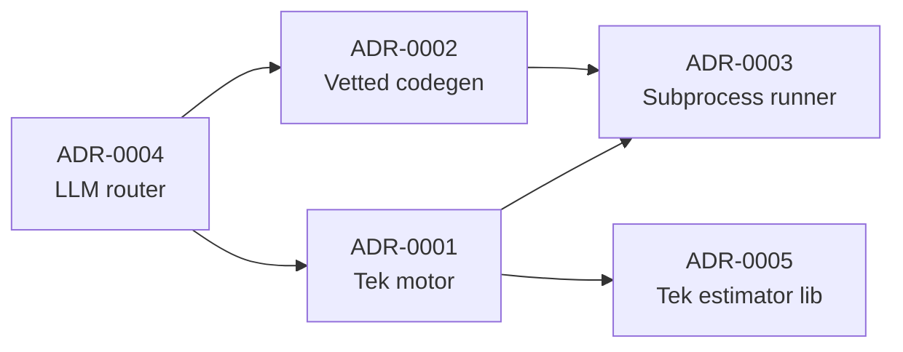

# ADR Index

Bu dosya, mimari karar kayıtlarını (ADR) tek bakışta izlemek için referans indeksidir.

## Durum Özeti

| ADR | Başlık | Durum | Karar Tarihi | Son Gözden Geçirme | Superseded By |
|---|---|---|---|---|---|
| [0001](0001-tek-motor-specification.md) | Tek motor: Specification atom birimi | accepted | 2026-07-05 | 2026-07-27 | - |
| [0002](0002-vetted-transform-codegen.md) | Codegen: kapalı/vetted transform kütüphanesi | accepted | 2026-07-05 | 2026-07-27 | - |
| [0003](0003-subprocess-runner.md) | Multiverse runner: subprocess | accepted | 2026-07-05 | 2026-07-27 | - |
| [0004](0004-pydanticai-model-router.md) | LLM katmanı: PydanticAI + model router | accepted | 2026-07-05 | 2026-07-27 | - |
| [0005](0005-tek-lib-pyfixest.md) | Tek estimator kütüphanesi: pyfixest | accepted | 2026-07-05 | 2026-07-27 | - |

## Hızlı Kapsam Haritası

- ADR-0001: [pareto/spec.py](../../pareto/spec.py), [pareto/contracts.py](../../pareto/contracts.py)
- ADR-0002: [pareto/cleaning/transforms.py](../../pareto/cleaning/transforms.py), [pareto/cleaning/agent.py](../../pareto/cleaning/agent.py), [pareto/cleaning/codegen.py](../../pareto/cleaning/codegen.py)
- ADR-0003: [pareto/analysis/runner.py](../../pareto/analysis/runner.py)
- ADR-0004: [pareto/llm/router.py](../../pareto/llm/router.py), [pareto/llm/providers.py](../../pareto/llm/providers.py), [pareto/llm/cache.py](../../pareto/llm/cache.py), [pareto/llm/guardrails.py](../../pareto/llm/guardrails.py)
- ADR-0005: [pareto/analysis/estimators.py](../../pareto/analysis/estimators.py)

## Karar Grafiği

Not: Şu anda superseded bir ADR yoktur; yeni bir karar eskisini geçersiz kıldığında
ilgili dosyalarda `Superseded by` / `Supersedes` alanları karşılıklı doldurulmalıdır.

Durum alanı için tek kaynak bu dosyadaki tablo kabul edilir; ADR metinlerindeki durum
satırları tabloyla çelişmemelidir.